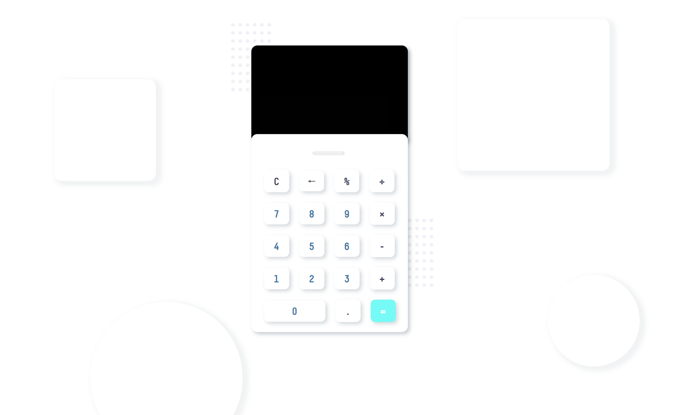

# Калькулятор

## Структура проекта:
- **App.css** - CSS файл для стилизации внешнего вида калькулятора.
- **InputNumber.js** - компонент для обработки ввода чисел.
- **OutputNumber.js** - компонент для отображения результата.
- **pictures/points.png** - изображение, используемое внутри калькулятора.

## Главные особенности проекта:
1. Используется хук useState для хранения состояния ввода и результата.
2. Реализованы функции **buttonNumber**, **clearInput**, **clearOne** и **calculateResult** для обработки событий и вычисления результата.
3. Используется библиотека **mathjs** для вычисления математических выражений.
4. Добавлены стили и расположение элементов с использованием CSS.
## Инструкции по запуску проекта:
- git clone <ссылка_на_репозиторий>
- cd <папка_проекта>
- npm install
- npm start